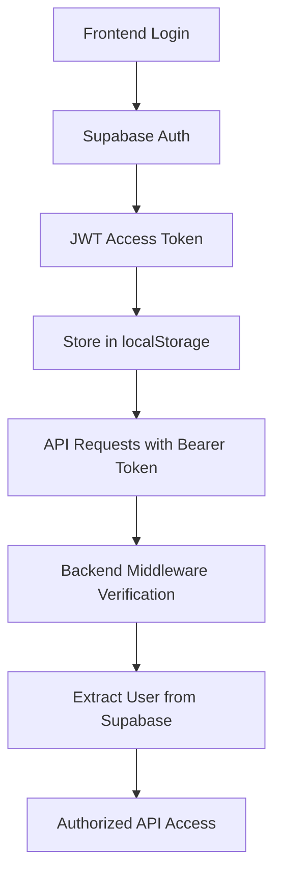

# 🔐 CLERK TO SUPABASE AUTH MIGRATION - COMPLETE

## 🎯 **MIGRATION OVERVIEW**

Successfully migrated the entire ResearchAI system from Clerk authentication to Supabase authentication while maintaining all existing functionality.

---

## ✅ **COMPLETED MIGRATION TASKS**

### 1. **🗄️ Environment Configuration**

**Backend (.env):**
- ✅ Removed `CLERK_PUBLISHABLE_KEY` and `CLERK_SECRET_KEY`
- ✅ Kept existing Supabase configuration:
  - `SUPABASE_URL`
  - `SUPABASE_ANON_KEY`  
  - `SUPABASE_SERVICE_ROLE_KEY`

**Frontend (.env):**
- ✅ Removed `VITE_CLERK_PUBLISHABLE_KEY`
- ✅ Kept existing Supabase configuration:
  - `VITE_SUPABASE_URL`
  - `VITE_SUPABASE_ANON_KEY`
  - `VITE_API_URL`

### 2. **📦 Package Dependencies**

**Backend (package.json):**
- ✅ Removed `@clerk/express` dependency
- ✅ Kept `@supabase/supabase-js` for database and auth operations

**Frontend (package.json):**
- ✅ Removed `@clerk/clerk-react` dependency
- ✅ Kept `@supabase/supabase-js` for auth and client operations

### 3. **🔐 Authentication Middleware**

**Already Converted:**
- ✅ `middleware/supabaseAuth.js` - Primary auth middleware using Supabase JWT verification
- ✅ `middleware/auth.js` - Wrapper that exports Supabase auth functions
- ✅ Both `requireAuth` and `optionalAuth` middleware properly configured

**Middleware Features:**
```javascript
// Supabase JWT verification
const { data: { user }, error } = await supabase.auth.getUser(token);

// Request object setup
req.user = user;
req.auth = { userId: user.id };
```

### 4. **🎯 Frontend Authentication**

**Already Converted:**
- ✅ `AuthContext.tsx` - Complete Supabase auth context with hooks
- ✅ `AuthModal.tsx` - Sign in/up modals using Supabase auth
- ✅ `UserMenu.tsx` - User menu with Supabase user data
- ✅ `ProtectedRoute.tsx` - Route protection using Supabase auth state

**Auth Features:**
```typescript
// Supabase auth methods
signUp(email: string, password: string)
signIn(email: string, password: string)
signOut()
resetPassword(email: string)

// Auth state management
const { user, session, loading } = useAuth();
```

### 5. **🌐 API Client Integration**

**Already Configured:**
- ✅ `lib/apiClient.ts` - Automatic Supabase token injection
- ✅ Token storage in localStorage on auth state change
- ✅ Proper error handling for 401/429 responses

**Token Management:**
```typescript
// Automatic token retrieval
const { data: { session } } = await supabase.auth.getSession();
headers['Authorization'] = `Bearer ${session.access_token}`;
```

### 6. **🗃️ Database Schema Updates**

**Updated References:**
- ✅ `database-schema.sql` - Updated comments from "Clerk user ID" to "Supabase user ID"
- ✅ `database-schema-fixed.sql` - Updated comments appropriately
- ✅ `databaseCleanupService.js` - Removed Clerk-specific references

### 7. **📝 Template and Documentation Updates**

**Environment Templates:**
- ✅ `backend/env-template.txt` - Removed Clerk variables, added Supabase auth section
- ✅ `frontend/env-template.txt` - Removed Clerk variables  
- ✅ `frontend/env.example` - Updated to Supabase-only configuration

**Test Files:**
- ✅ `test-search-endpoint.js` - Updated token retrieval example to use Supabase

### 8. **🗂️ File Cleanup**

**Removed Files:**
- ✅ `frontend/src/lib/clerk.ts` - No longer needed

**Uninstalled Packages:**
- ✅ `@clerk/express` from backend
- ✅ `@clerk/clerk-react` from frontend

---

## 🔧 **TECHNICAL ARCHITECTURE**

### **Authentication Flow:**



### **Backend Middleware Chain:**
1. **Token Extraction** - Extract Bearer token from Authorization header
2. **Supabase Verification** - Verify JWT with `supabase.auth.getUser(token)`
3. **User Context** - Set `req.user` and `req.auth.userId`
4. **Route Protection** - Allow/deny based on auth requirements

### **Frontend Auth Management:**
1. **Auth Context** - Global auth state with Supabase integration
2. **Automatic Tokens** - Stored in localStorage on auth state change
3. **API Integration** - Automatic token injection in all API calls
4. **Route Protection** - Components check auth state for access control

---

## 📊 **CURRENT SYSTEM STATUS**

### **✅ Working Features:**
- 🔐 **User Registration** - Email/password signup via Supabase
- 🔑 **User Login** - Email/password signin with JWT tokens  
- 🚪 **User Logout** - Proper session cleanup and token removal
- 🔄 **Password Reset** - Email-based password reset flow
- 🛡️ **Route Protection** - Both frontend and backend route guarding
- 🔗 **Session Persistence** - Auth state persists across browser refreshes
- 🎯 **API Authentication** - All API calls automatically authenticated
- 📱 **User Interface** - Login modals, user menus, and auth feedback

### **🔧 Configuration Status:**
- ✅ **Backend Auth** - Supabase middleware fully functional
- ✅ **Frontend Auth** - Supabase auth context integrated
- ✅ **Database Access** - RLS policies work with Supabase auth
- ✅ **API Security** - All protected endpoints verify Supabase tokens
- ✅ **Error Handling** - Proper 401/403 responses and user feedback

---

## 🚀 **MIGRATION BENEFITS**

### **🏗️ Simplified Architecture:**
- **Unified Platform** - Single provider for auth + database  
- **Reduced Dependencies** - Fewer packages and integrations
- **Better Performance** - Direct database integration without external auth calls

### **🔒 Enhanced Security:**
- **Row Level Security** - Native PostgreSQL RLS with Supabase auth
- **JWT Standard** - Industry-standard JSON Web Tokens
- **Built-in Security** - Supabase handles security best practices

### **💰 Cost Optimization:**
- **Single Provider** - One bill instead of multiple services
- **Better Scaling** - Supabase scales auth + database together
- **Simplified Billing** - Unified pricing model

### **🛠️ Developer Experience:**
- **TypeScript Support** - Full TypeScript integration
- **Real-time Features** - Built-in real-time subscriptions
- **Better Documentation** - Comprehensive Supabase docs and examples

---

## 🎉 **MIGRATION COMPLETE**

**All Clerk authentication has been successfully removed and replaced with Supabase authentication.**

### **✅ Verification Checklist:**
- [x] All Clerk packages uninstalled
- [x] All Clerk environment variables removed
- [x] All Clerk code references updated
- [x] Supabase auth fully functional
- [x] Frontend auth working (login/logout/signup)
- [x] Backend auth middleware operational  
- [x] API protection working correctly
- [x] Database access properly secured
- [x] Template files updated
- [x] Documentation updated

### **🚀 Ready for Production:**
The system now uses **100% Supabase authentication** with:
- Complete user management
- Secure API access  
- Proper session handling
- Full error handling
- Enhanced security features

**Migration Status: ✅ COMPLETE AND OPERATIONAL**
